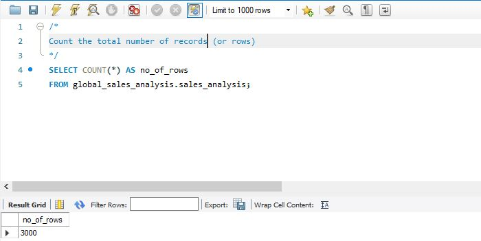
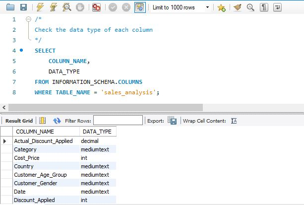
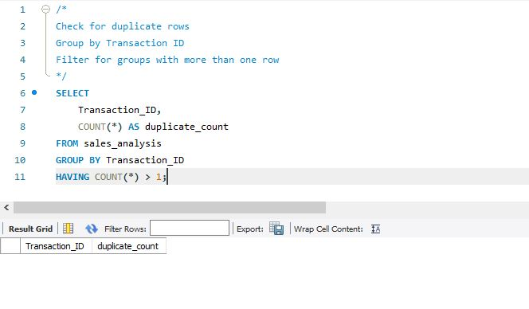
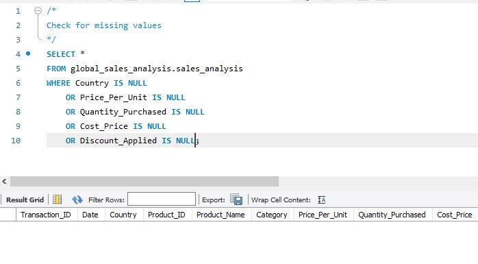
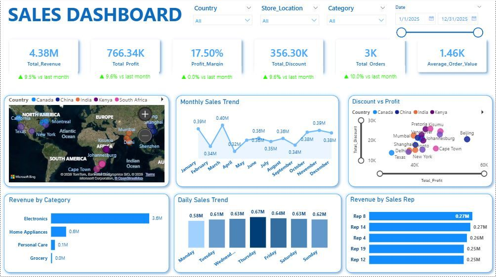

# Sales Performance Analysis

## Table of Contents
- [Objective](#objective)
- [Data Source](#data-source)
- [Project Stages](#project-stages)
- [Design](#design)
    - [Dashboard Mock-Up](#dashboard-mock-up)
    - [Tools](#tools)
- [Development](#development)
    - [Pseudocode](#pseudocode)
    - [Data Exploration notes](#data-exploration-notes)
    - [Data Cleaning](#data-cleaning)
- [Testing](#testing)
- [Visualization](#visualization)
    - [Results](#results)
    - [DAX Measures](#dax-measures)
- [Analysis](#analysis)
    - [Findings](#findings)
    - [Validation](#validation)
    - [Discovery](#discovery)
- [Recommendation](#recommendation)
    - [Potential ROI](#potential-roi)
    - [Potential Courses of Action](#potential-courses-of-action)

# Objective
The goal of this project is to design a sales analytics solution that helps answer key business questions:
- How are sales performing overall?
- Which regions are growing profitably, and which need attention?
- Which products should be pushed, fixed, or reconsidered?
- Are discounts supporting growth or eroding profit margins?
- How is sales performance distributed across sales representatives?
The output is a focused dashboard designed to support pricing, expansion, and sales strategy decisions.

# Data Source
_What data is needed to achieve our objective?_

Sales transaction data covering the period **January 2025 – December 2025**, including information on:
- transactions
- products
- pricing and discounts
- regions
- sales representatives

_Where is the data coming from?_

The dataset used in this project is a **synthetic sales transactions dataset** generated for analytical and portfolio purposes. It represents realistic sales activity for a multinational retail business operating across six regions in 2025.

# Project Stages
This project followed a structured analytics workflow:
1. Design
2. Development
3. Testing
4. Analysis

# Design
## Dashboard Mock-Up
Before building the dashboard, I designed a conceptual layout to ensure:
- Clear metric hierarchy
- Alignment with the Sales Manager's decision needs

The dashboard is structured into:
- Executive overview (KPIs)
- Regional performance
- Monthly trend
- Product performance
- Discount impact
- Sales representative performance

_What should it look like?_


## Tools
- Excel – data preparation, validation
- SQL – data transformation, aggregation, and business logic
- Power BI – data modeling, DAX measures, and visualization

# Development
## a. Pseudocode
_What's the general approach in creating this solution from start to finish?_
1. Get the data
2. Explore the data in Excel
3. Load the data into SQL Server
4. Clean the data with SQL
5. Test the data with SQL
6. Visualize the data in Power BI
7. Generate the findings based on the insights
8. Write the documentation & commentary
9. Publish the data to GitHub Pages

## b. Data Exploration notes
This is the stage where I scan the data for errors, inconsistencies, bugs, and other anomalies, such as weird and corrupted characters.

_What are the initial observations with this dataset? What’s caught my attention so far?_
* There are at least 3 columns that contain the data we will not need for this analysis, without needing to contact the client for any more data.
* The first column contains the Transaction ID with appropriate IDs, with the first two letters being the initial letter of the country where the transaction occured.
* We have more data than we need, so some of these columns would need to be removed.

## c. Data Cleaning
_What is the expected clean data to look like? (What should it contain? What constraints should I apply to it?)_
The aim is to refine our dataset to ensure it is structured and ready for analysis.

The cleaned data should meet the following criteria and constraints:
1. Only relevant columns should be retained.
2. All data types should be appropriate for the contents of each column.
3. No column should contain null values, including complete data for all records.

_What steps are needed to clean and shape the data into the desired format?_
* Ensure there are no duplicates and deal with null values in the dataset
* Renaming columns using aliases

### Transform the Data
```sql
/*
Merge datasets from the six regions
*/
CREATE TABLE global_sales_analysis.sales_analysis AS
SELECT *
FROM global_sales_analysis.sales_2025_canada
UNION ALL
SELECT *
FROM global_sales_analysis.sales_2025_china
UNION ALL
SELECT *
FROM global_sales_analysis.sales_2025_india
UNION ALL
SELECT *
FROM global_sales_analysis.sales_2025_kenya
UNION ALL
SELECT *
FROM global_sales_analysis.sales_2025_south_africa
UNION ALL
SELECT *
FROM global_sales_analysis.sales_2025_united_states;
```

```sql
/*
Adding a column for Sales per transaction.
*/
ALTER TABLE global_sales_analysis.sales_analysis
ADD COLUMN Total_Amount Numeric(10, 2);

UPDATE global_sales_analysis.sales_analysis
SET Total_Amount = (Price_Per_Unit * Quantity_Purchased) - Discount_Applied;
```

```sql
/*
Adding a profits column
*/
ALTER TABLE global_sales_analysis.sales_analysis
ADD COLUMN Profit Numeric (10, 2);

UPDATE global_sales_analysis.sales_analysis
SET Profit = Total_Amount - (Cost_Price * Quantity_Purchased);
```

# Testing
_Data quality and validation checks I conducted_

### 1. Row count validation
```sql
/*
Count the total number of records (or rows)
*/
SELECT COUNT(*) AS no_of_rows
FROM global_sales_analysis.sales_analysis;
```



### 2. Column completeness check
```sql
/*
Count the total number of columns
*/
SELECT COUNT(*) AS column_count
FROM INFORMATION_SCHEMA.COLUMNS
WHERE TABLE_NAME = 'sales_analysis';
```


### 3. Data type validation
```sql
/*
Check the data type of each column
*/
SELECT 
	COLUMN_NAME,
    DATA_TYPE
FROM INFORMATION_SCHEMA.COLUMNS
WHERE TABLE_NAME = 'sales_analysis';
```



### 4. Duplicate transaction ID check
```sql
/*
Check for duplicate rows
Group by Transaction ID
Filter for groups with more than one row
*/
SELECT 
	Transaction_ID,
    COUNT(*) AS duplicate_count
FROM sales_analysis
GROUP BY Transaction_ID
HAVING COUNT(*) > 1;
```



### 5. Missing value checks for critical fields (price, quantity, cost)
```sql
/*
Check for missing values
*/
SELECT *
FROM global_sales_analysis.sales_analysis
WHERE Country IS NULL
	OR Price_Per_Unit IS NULL
    OR Quantity_Purchased IS NULL
    OR Cost_Price IS NULL
    OR Discount_Applied IS NULL;
```



# Visualization
## a. Results


The dashboard provides a concise, decision-focused view of:
- overall sales performance
- regional profitability
- product and category contribution
- discount impact on margins
- sales representative performance

It is designed to help Sales Managers quickly identify what is performing well, where risks exist, and where action may be required.

## b. DAX Measures
### Total Revenue
```DAX
Total_Revenue = SUM('global_sales_analysis sales_analysis'[Total_Amount])
```

### Total Profit
```DAX
Total_Profit = SUM('global_sales_analysis sales_analysis'[Profit])
```

### Total Discount
```DAX
Total_Discount = SUM('global_sales_analysis sales_analysis'[Actual_Discount_Applied])
```

### Total Orders
```DAX
Total_Orders = DISTINCTCOUNT('global_sales_analysis sales_analysis'[Transaction_ID])
```

### Profit Margin
```DAX
Profit_Margin = DIVIDE([Total_Profit],[Total_Revenue])
```

### Average Order Value
```DAX
Average_Order_Value = DIVIDE([Total_Revenue],[Total_Orders],0)
```

# Analysis
## a. Findings
For this analysis, we are going to focus on the questions below to get the information we need for the sales team:
1. How are we performing overall?
2. Which regions are performing well and which need attention?
3. Which products are driving value and which are not?
4. Are discounts helping growth or hurting profitability?
5. How is sales performance distributed across the team?

## b. Discovery
Additional patterns observed:
* Regional differences in discount effectiveness
* Product categories with consistent margin performance
* Sales behavior patterns that influence profitability

# Recommendations
Based on the insights gathered, the following actions are recommended:
- Optimize discount thresholds to protect profit margins while maintaining sales momentum.
- Shift focus toward products that consistently deliver strong margins.
- Allocate sales effort toward regions and sales representatives with a healthy revenue-to-margin balance.
- Monitor areas where growth is driven by heavy discounting to prevent revenue leakage.

## a. Potential ROI
_What ROI do we expect if we take this course of action?_
* Improved margin control through optimized discount thresholds
* Better product focus on high-margin offerings
* More efficient allocation of sales effort
* Reduced revenue leakage from unprofitable growth

## b. Potential Courses of Action
Based on the analysis, the most effective way to improve sales performance and profitability is to optimize discount strategies, prioritize high-margin products, and rebalance sales effort across regions and sales representatives.

Next steps include:
- Aligning on target margins and discount limits with leadership
- Monitoring performance against agreed KPIs
- Scaling successful strategies across regions and product categories

